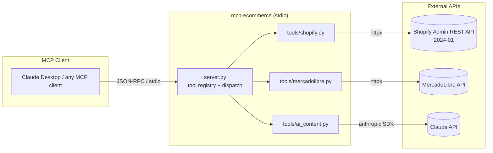
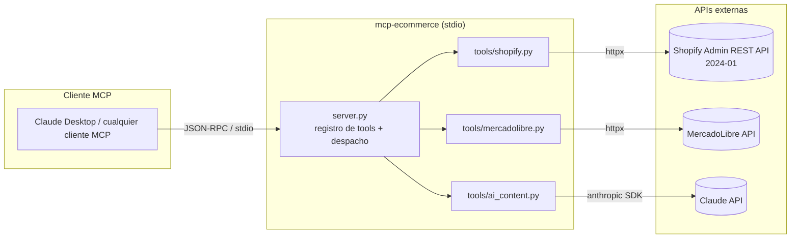

# MCP E-commerce Server — Shopify + MercadoLibre automation over MCP


> **MCP server** — exposes a store-automation toolset (list products, bulk price updates, AI-generated SEO descriptions, and automatic buyer-question answering) to any MCP client such as Claude Desktop, over stdio, for Shopify and MercadoLibre sellers.

---

<details open>
<summary><h2>🇺🇸 English</h2></summary>

### Overview

`mcp-ecommerce` is a Python [Model Context Protocol](https://modelcontextprotocol.io) server. It runs locally over **stdio** and lets an MCP-capable assistant operate two store back-ends — **Shopify** (Admin REST API) and **MercadoLibre** (public API) — while delegating copywriting and customer replies to the **Claude API**. The assistant sees a small, typed toolset; the server does the API calls and returns human-readable summaries.

---

### Architecture



---

### Features

- **List products across platforms** — `list_products` returns products from Shopify or MercadoLibre with price, stock, status and IDs.
- **AI SEO descriptions in bulk** — `generate_descriptions` writes SEO-optimized product copy with Claude (Spanish or English, selectable tone), for one product or a whole catalog, with an optional `auto_apply` to push copy straight to the store or a preview-only dry run.
- **Bulk price updates** — `bulk_update_prices` updates many Shopify variants at once, either from an explicit list or by applying a single `percentage_change` across all active products.
- **Single MercadoLibre price update** — `update_ml_price` changes the price of one listing by item ID.
- **Unanswered-question inbox** — `get_unanswered_questions` pulls pending buyer questions from MercadoLibre.
- **Automatic buyer replies** — `auto_answer_questions` drafts answers with Claude and either previews them (`dry_run`) or posts them to MercadoLibre.
- **Recent orders** — `get_orders` returns recent Shopify orders with financial/fulfillment status and computes total revenue.
- **Clean separation of concerns** — platform I/O (`tools/shopify.py`, `tools/mercadolibre.py`) is kept apart from AI generation (`tools/ai_content.py`); every tool catches its own errors and returns a readable message instead of crashing the session.

---

### Quick Start

```bash
# 1. Clone
git clone https://github.com/cdgutierrez6/mcp-ecommerce.git
cd mcp-ecommerce

# 2. Create a virtualenv and install deps
python -m venv venv
# Windows
venv\Scripts\activate
# macOS / Linux
source venv/bin/activate
pip install -r requirements.txt

# (Windows shortcut: setup.bat does the venv + install for you)

# 3. Configure credentials
cp .env.example .env
#   then fill in your Shopify / MercadoLibre / Claude keys

# 4. Run the server (it speaks MCP over stdio)
python server.py
```

**Connecting from Claude Desktop** — add the server to `claude_desktop_config.json`:

```json
{
  "mcpServers": {
    "mcp-ecommerce": {
      "command": "python",
      "args": ["C:/path/to/mcp-ecommerce/server.py"],
      "env": {
        "SHOPIFY_STORE_URL": "your-store.myshopify.com",
        "SHOPIFY_ACCESS_TOKEN": "shpat_...",
        "ML_ACCESS_TOKEN": "APP_USR-...",
        "ML_USER_ID": "123456789",
        "ANTHROPIC_API_KEY": "sk-ant-..."
      }
    }
  }
}
```

Restart Claude Desktop; the seven tools appear under the server. The server also reads a local `.env`, so the `env` block is optional if that file is present.

---

### Project Structure

```
mcp-ecommerce/
├── server.py            # MCP entry point — registers 7 tools, dispatches calls over stdio
├── tools/
│   ├── __init__.py
│   ├── shopify.py       # Shopify Admin REST API: products, variant prices, orders
│   ├── mercadolibre.py  # MercadoLibre API: listings, price, description, Q&A
│   └── ai_content.py    # Claude API: SEO descriptions + buyer-answer generation
├── utils/               # Reserved for shared helpers (currently empty)
├── requirements.txt     # mcp, anthropic, httpx, shopifyapi, pandas, openpyxl, requests, python-dotenv
├── setup.bat            # Windows one-shot venv + pip install
├── .env.example         # Credential template
└── CLAUDE.md            # Project notes for AI-assisted development
```

---

### API Reference (MCP tools)

The server exposes **7 tools**:

| Tool | Platform | Description |
|------|----------|-------------|
| `list_products` | Shopify / MercadoLibre | Lists products with price, stock and ID (`platform`, `limit`, `status`). |
| `generate_descriptions` | Shopify / MercadoLibre | Generates SEO product descriptions with AI; `auto_apply=true` writes them to the store, otherwise preview only. |
| `bulk_update_prices` | Shopify | Updates many variant prices from a list, or applies a `percentage_change` to all active products. |
| `update_ml_price` | MercadoLibre | Updates the price of a single listing by `item_id`. |
| `get_unanswered_questions` | MercadoLibre | Returns pending buyer questions. |
| `auto_answer_questions` | MercadoLibre | Drafts AI answers; `dry_run=true` previews, `false` posts them. |
| `get_orders` | Shopify | Returns recent orders and total revenue over a window of `days`. |

---

### Environment Variables

Read directly by the code (`os.getenv`):

| Variable | Description | Required |
|----------|-------------|----------|
| `ANTHROPIC_API_KEY` | Claude API key — powers `generate_descriptions` and `auto_answer_questions`. | Yes (for AI tools) |
| `SHOPIFY_STORE_URL` | Store domain, e.g. `your-store.myshopify.com`. | Yes (for Shopify tools) |
| `SHOPIFY_ACCESS_TOKEN` | Shopify Admin API access token (`shpat_...`). | Yes (for Shopify tools) |
| `ML_ACCESS_TOKEN` | MercadoLibre OAuth access token (`APP_USR-...`). | Yes (for ML tools) |
| `ML_USER_ID` | MercadoLibre seller/user ID — required to list items and questions. | Yes (for ML tools) |

`.env.example` also ships placeholders for `ML_SITE_ID` and WooCommerce keys; those are not yet consumed by the current code.

---

### Tech Stack

- **Python 3.10+** — target runtime.
- **`mcp` (Python SDK)** — MCP `Server` + `stdio_server` transport.
- **`anthropic`** — Claude API client; content is generated with the `claude-haiku-4-5` model.
- **`httpx`** — synchronous HTTP client for Shopify and MercadoLibre calls.
- **`python-dotenv`** — loads credentials from `.env`.
- **`requests`, `shopifyapi`, `pandas`, `openpyxl`** — declared dependencies for HTTP, Shopify helpers and spreadsheet handling.

---

### Author

**Cristian Daniel Gutiérrez S.** — Solutions Architect | Full-Stack Engineer

[LinkedIn](https://www.linkedin.com/in/cristian-daniel-guti%C3%A9rrez-segura) · [Portfolio](https://portafolio-frontend-wheat.vercel.app) · [cdgutierrez6@gmail.com](mailto:cdgutierrez6@gmail.com)

</details>

---

<details>
<summary><h2>🇨🇴 Español</h2></summary>

### Descripción General

`mcp-ecommerce` es un servidor [Model Context Protocol](https://modelcontextprotocol.io) en Python. Corre localmente sobre **stdio** y le permite a un asistente compatible con MCP operar dos back-ends de tienda — **Shopify** (Admin REST API) y **MercadoLibre** (API pública) — delegando la redacción y las respuestas a clientes en la **Claude API**. El asistente ve un conjunto pequeño y tipado de herramientas; el servidor hace las llamadas a las APIs y devuelve resúmenes legibles.

---

### Arquitectura



---

### Características

- **Listar productos entre plataformas** — `list_products` devuelve productos de Shopify o MercadoLibre con precio, stock, estado e IDs.
- **Descripciones SEO con IA en bulk** — `generate_descriptions` redacta copy de producto optimizado para SEO con Claude (español o inglés, tono seleccionable), para un producto o un catálogo entero, con un `auto_apply` opcional para publicar el copy directo en la tienda o solo previsualizarlo (dry run).
- **Actualización masiva de precios** — `bulk_update_prices` actualiza muchas variantes de Shopify a la vez, desde una lista explícita o aplicando un solo `percentage_change` a todos los productos activos.
- **Actualización individual de precio en MercadoLibre** — `update_ml_price` cambia el precio de una publicación por su item ID.
- **Bandeja de preguntas sin responder** — `get_unanswered_questions` trae las preguntas pendientes de compradores en MercadoLibre.
- **Respuestas automáticas a compradores** — `auto_answer_questions` redacta respuestas con Claude y las previsualiza (`dry_run`) o las publica en MercadoLibre.
- **Pedidos recientes** — `get_orders` devuelve pedidos recientes de Shopify con estado financiero/de envío y calcula el revenue total.
- **Separación limpia de responsabilidades** — la I/O de plataforma (`tools/shopify.py`, `tools/mercadolibre.py`) se mantiene aparte de la generación con IA (`tools/ai_content.py`); cada tool captura sus propios errores y devuelve un mensaje legible en vez de tumbar la sesión.

---

### Inicio Rápido

```bash
# 1. Clonar
git clone https://github.com/cdgutierrez6/mcp-ecommerce.git
cd mcp-ecommerce

# 2. Crear un virtualenv e instalar dependencias
python -m venv venv
# Windows
venv\Scripts\activate
# macOS / Linux
source venv/bin/activate
pip install -r requirements.txt

# (Atajo en Windows: setup.bat crea el venv e instala por ti)

# 3. Configurar credenciales
cp .env.example .env
#   luego llena tus llaves de Shopify / MercadoLibre / Claude

# 4. Correr el servidor (habla MCP sobre stdio)
python server.py
```

**Conectar desde Claude Desktop** — agrega el servidor a `claude_desktop_config.json`:

```json
{
  "mcpServers": {
    "mcp-ecommerce": {
      "command": "python",
      "args": ["C:/ruta/a/mcp-ecommerce/server.py"],
      "env": {
        "SHOPIFY_STORE_URL": "tu-tienda.myshopify.com",
        "SHOPIFY_ACCESS_TOKEN": "shpat_...",
        "ML_ACCESS_TOKEN": "APP_USR-...",
        "ML_USER_ID": "123456789",
        "ANTHROPIC_API_KEY": "sk-ant-..."
      }
    }
  }
}
```

Reinicia Claude Desktop; las siete herramientas aparecen bajo el servidor. El servidor también lee un `.env` local, así que el bloque `env` es opcional si ese archivo está presente.

---

### Estructura del Proyecto

```
mcp-ecommerce/
├── server.py            # Entry point MCP — registra 7 tools, despacha llamadas sobre stdio
├── tools/
│   ├── __init__.py
│   ├── shopify.py       # Shopify Admin REST API: productos, precios de variantes, pedidos
│   ├── mercadolibre.py  # MercadoLibre API: publicaciones, precio, descripción, preguntas
│   └── ai_content.py    # Claude API: descripciones SEO + generación de respuestas
├── utils/               # Reservado para helpers compartidos (actualmente vacío)
├── requirements.txt     # mcp, anthropic, httpx, shopifyapi, pandas, openpyxl, requests, python-dotenv
├── setup.bat            # Instalación one-shot en Windows (venv + pip install)
├── .env.example         # Plantilla de credenciales
└── CLAUDE.md            # Notas del proyecto para desarrollo asistido por IA
```

---

### Referencia de API (herramientas MCP)

El servidor expone **7 herramientas**:

| Herramienta | Plataforma | Descripción |
|-------------|------------|-------------|
| `list_products` | Shopify / MercadoLibre | Lista productos con precio, stock e ID (`platform`, `limit`, `status`). |
| `generate_descriptions` | Shopify / MercadoLibre | Genera descripciones SEO con IA; `auto_apply=true` las escribe en la tienda, si no solo previsualiza. |
| `bulk_update_prices` | Shopify | Actualiza muchos precios de variantes desde una lista, o aplica un `percentage_change` a todos los productos activos. |
| `update_ml_price` | MercadoLibre | Actualiza el precio de una publicación por `item_id`. |
| `get_unanswered_questions` | MercadoLibre | Devuelve las preguntas pendientes de compradores. |
| `auto_answer_questions` | MercadoLibre | Redacta respuestas con IA; `dry_run=true` previsualiza, `false` las publica. |
| `get_orders` | Shopify | Devuelve pedidos recientes y revenue total en una ventana de `days`. |

---

### Variables de Entorno

Leídas directamente por el código (`os.getenv`):

| Variable | Descripción | Requerida |
|----------|-------------|-----------|
| `ANTHROPIC_API_KEY` | Llave de la Claude API — impulsa `generate_descriptions` y `auto_answer_questions`. | Sí (para tools de IA) |
| `SHOPIFY_STORE_URL` | Dominio de la tienda, ej. `tu-tienda.myshopify.com`. | Sí (para tools de Shopify) |
| `SHOPIFY_ACCESS_TOKEN` | Token de acceso de la Shopify Admin API (`shpat_...`). | Sí (para tools de Shopify) |
| `ML_ACCESS_TOKEN` | Token OAuth de MercadoLibre (`APP_USR-...`). | Sí (para tools de ML) |
| `ML_USER_ID` | ID de vendedor/usuario de MercadoLibre — requerido para listar ítems y preguntas. | Sí (para tools de ML) |

`.env.example` incluye además placeholders para `ML_SITE_ID` y llaves de WooCommerce; el código actual todavía no los consume.

---

### Tecnologías

- **Python 3.10+** — runtime objetivo.
- **`mcp` (SDK de Python)** — `Server` de MCP + transporte `stdio_server`.
- **`anthropic`** — cliente de la Claude API; el contenido se genera con el modelo `claude-haiku-4-5`.
- **`httpx`** — cliente HTTP síncrono para las llamadas a Shopify y MercadoLibre.
- **`python-dotenv`** — carga las credenciales desde `.env`.
- **`requests`, `shopifyapi`, `pandas`, `openpyxl`** — dependencias declaradas para HTTP, helpers de Shopify y manejo de hojas de cálculo.

---

### Autor

**Cristian Daniel Gutiérrez S.** — Arquitecto de Soluciones | Ingeniero Full-Stack

[LinkedIn](https://www.linkedin.com/in/cristian-daniel-guti%C3%A9rrez-segura) · [Portafolio](https://portafolio-frontend-wheat.vercel.app) · [cdgutierrez6@gmail.com](mailto:cdgutierrez6@gmail.com)

</details>
